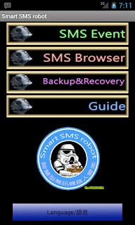

# Smart SMS Robot (Android APP)

> This APP is no longer maintained and had been removed from Google Play Store.

Smart SMS Robot is the Android APP that supports sending SMS by schedule.
Built with love as the biggest STAR WARS fans.

## Features

| Feature | Description |
|:--------|:------------|
| SMS event | A **SMS event** means a SMS sending schedule. Your SMS will be send at you scheduled time automatically. |
| SMS Browser | When you get a SMS, you can save it and lock it. The locked SMS will be encrypted and only you can see the decrypted content. |
| Backup & Recovery | Export/Import your data includes saved SMS in Smart SMS Robot. |
| Guide | Learn how to use **Smart SMS robot**. |
| Language/語言 | Choose the language of User interface. |

## Guide

See [WIKI](https://github.com/KarateJB/Android.SmartSmsRobot/wiki)

## Tech Stack

- Android SDK (Java)
- SQLite

